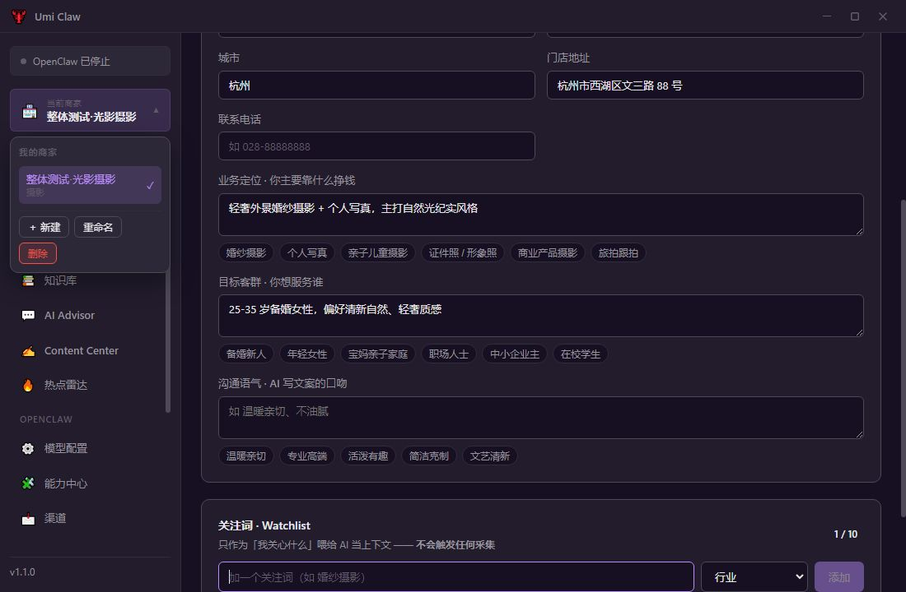
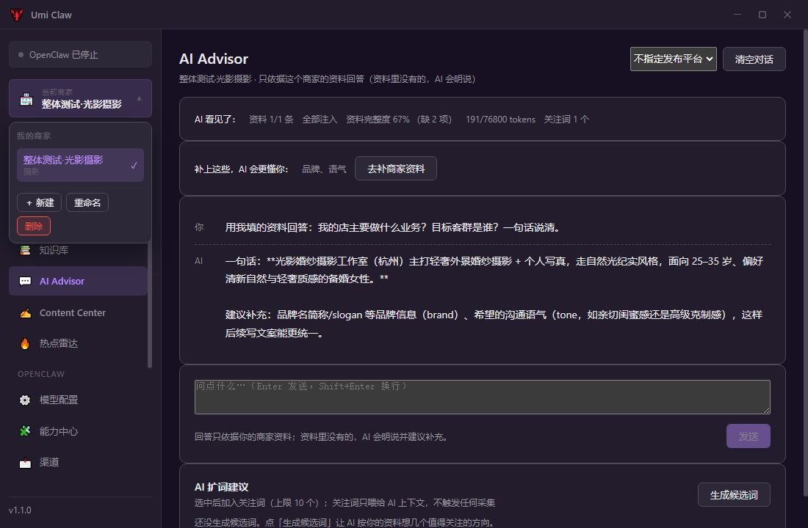
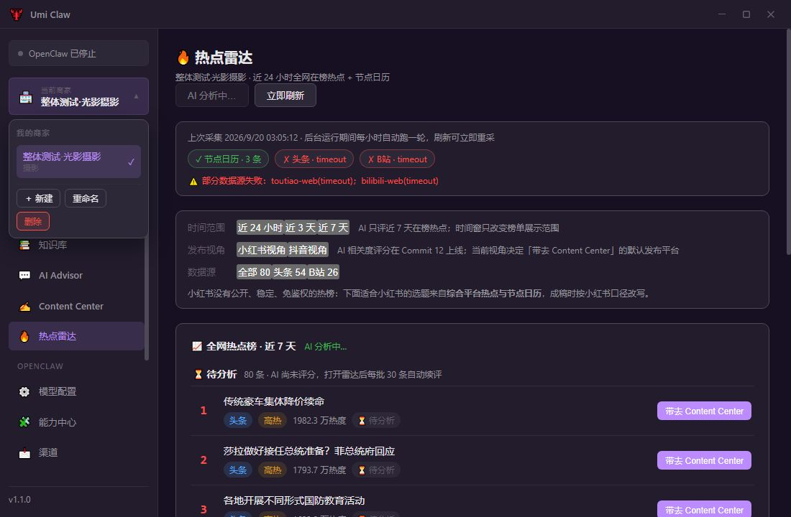
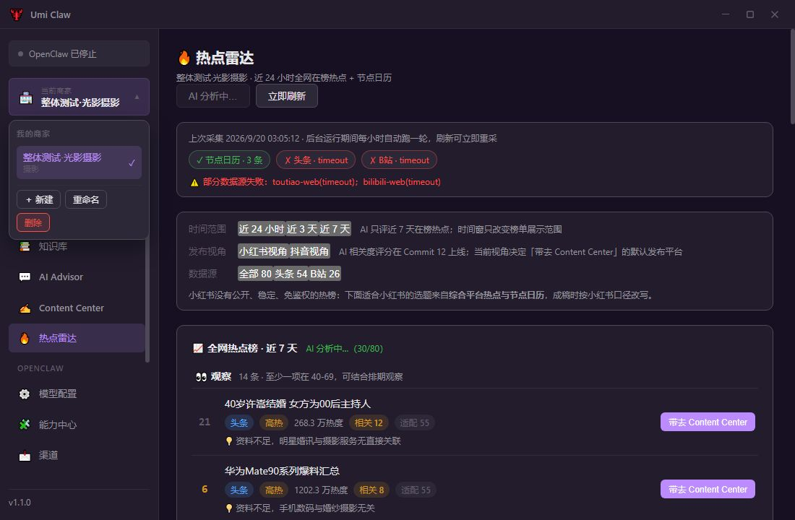
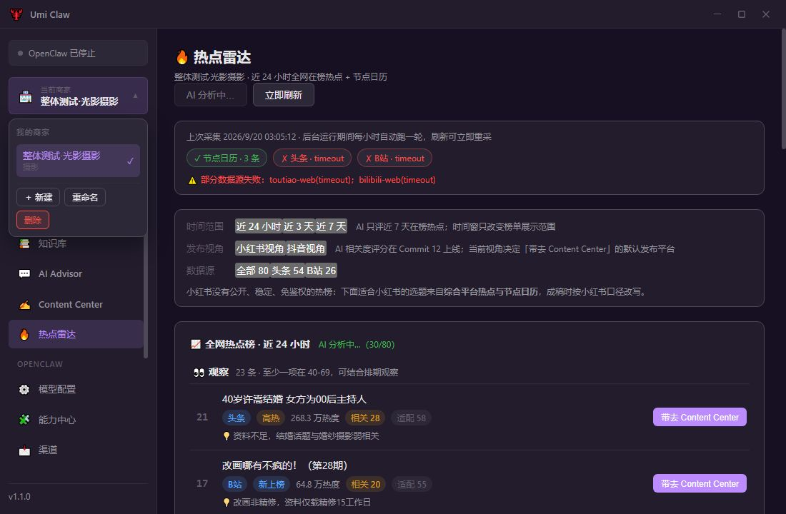
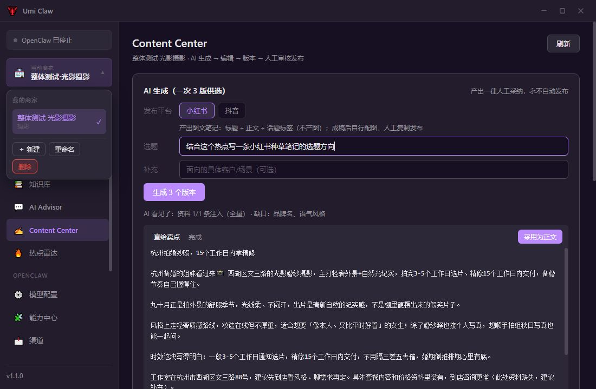
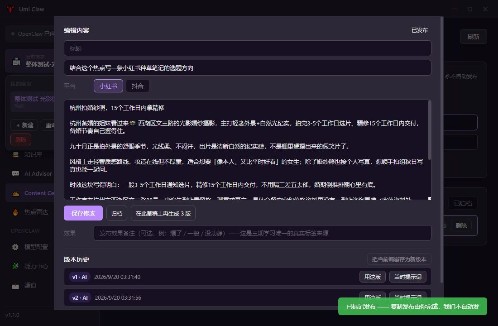

# 一期整体测试报告（Commit 00–12）

> 结论：**通过，可以继续交付演示/试用包。**
>
> 本轮用真 Electron GUI、真数据库 Worker、真网关和真 SSE 模型请求走完整老板每日动线；GUI E2E **19/19 通过**，专项验收 **214/214 通过**，TypeScript 类型检查通过，渲染端与主进程均未发现错误日志。

## 1. 测试元信息

| 项目 | 内容 |
| --- | --- |
| 测试时间 | 2026-09-20 03:28:57 – 03:37:23（GMT+8） |
| 分支 | release/2.0 |
| 被测提交 | 1261b816df7aa2396c4d4c522885bc98c396635e（feat(2.0-12)） |
| 应用版本 | package.json v1.1.0 |
| GUI E2E | 19/19 通过，总耗时 505.094 秒 |
| 专项验收 | 13 套、214/214 通过 |
| 静态检查 | npm run typecheck 通过 |
| 网关状态 | http://127.0.0.1:3213/health 返回 {"ok":true,"status":"live"} |
| 运行时 | Windows x64；便携 Node v24.14.0；Electron 30 |
| 基础数据 | 隔离副本：80 条近 7 天 board 热点 + 3 个日历节点；projects/businesses/contents/scores 初始为空 |

## 2. 测试方法与安全隔离

本轮不是纯函数或 mock 测试，而是从真实 Electron 页面驱动业务点击流：

1. 将正式库通过 SQLite VACUUM INTO 复制到 %TEMP%/umi-phase1-e2e-gui-*，测试进程通过 CLAW_DATA_DIR 只写隔离数据目录。
2. 为隔离目录挂载 runtime junction，并放入最小 openclaw 目录标识；真实数据库 Worker 和便携 Node 均参与执行。
3. 隔离 app.json 强制 autoStart=false；测试全程**不点击 Dashboard 的“启动”按钮**，避免 taskkill 影响宿主上正在运行的 OpenClaw/网关。
4. 启动带 CDP 9223 端口的真 Electron，通过 Chrome DevTools Protocol 执行真实 hash 路由、点击、输入、SSE 等待和 DOM 断言。
5. Advisor、热点评分、Content 三版生成均访问已存活的 127.0.0.1:3213 真网关；不伪造流式响应。
6. 每个关键步骤保存截图，结构化结果写入 test/e2e-result.json，控制台输出写入 test/e2e-run.log。

报告和产物不包含 app.json 密钥内容。

## 3. 总体结果

| 检验层 | 结果 | 说明 |
| --- | --- | --- |
| GUI 端到端 | 19/19 通过 | 覆盖建商家、资料、知识库、Advisor、热点、AI 评分、内容生成、审核流和页面巡检 |
| 专项验收 | 214/214 通过 | Commit 02–12 的 DB、IPC、业务、网关、热点、评分等 13 套验收 |
| 类型检查 | 通过 | tsc --noEmit 无错误 |
| 渲染端异常 | 0 条 | 未捕获 exception 与 console.error 均为 0 |
| 主进程错误 | 0 行 | Electron stdout/stderr 未筛选到错误行 |
| 截图 | 19 张全部生成 | 无截图超时或缺失 |

## 4. GUI E2E 明细

| 编号 | 场景 | 结果 | 耗时 | 关键证据 |
| --- | --- | --- | ---:| --- |
| T1 | 启动进控制台、Setup 守卫、12 模块导航 | 通过 | 32ms | Dashboard 显示控制台、当前商家、AI 营销、服务端口 |
| T2 | 新建商家 | 通过 | 1.886s | 创建并选中“整体测试·光影摄影” |
| T3 | 商家大脑六项资料 + 关注词 | 通过 | 4.248s | input/textarea 回显正确，关注词入库 |
| T4 | FAQ 录入、切词、入库与 LIKE 检索 | 通过 | 3.117s | “选片”能命中新增 FAQ |
| T5 | AI Advisor 真 SSE 问答 | 通过 | 7.651s | 流式期间出现“停止生成”；回答准确引用杭州地址、自然光纪实定位、25–35 岁备婚女性客群 |
| T6 | 热点雷达渲染、时间窗、发布视角、数据源筛选 | 通过 | 12.220s | 总榜 80 条、日历 3 个；头条 54、B站 26；24h/72h/7d 均为 80 |
| T6b | 首批 30 条 AI 评分 | 通过 | 78.023s | 进度（30/80）；观察 14、不建议 16、待分析 50；今日建议为空，符合“宁缺毋滥” |
| T7 | 热点带去 Content Center，真生成 3 版 | 通过 | 70.001s | 预填携带热点来源、建议角度、热度策略；三版生成期间有停止按钮，生成后可采用 |
| T7b | 内容审核流 | 通过 | 5.538s | 提交审核 → 审核通过 → 标记已发布，列表/弹窗状态成为“已发布” |
| T8 | 续评完成后手动“重新分析” | 通过 | 280.826s | 触发前 80/80 已评：观察 21、不建议 59；force 轮重新进入（30/80） |
| P-config | 模型配置页面巡检 | 通过 | 3.448s | 1139 字、360 节点，无白屏 |
| P-skills | 能力中心页面巡检 | 通过 | 3.458s | 366 字、131 节点 |
| P-logs | 运行日志页面巡检 | 通过 | 3.457s | 340 字、146 节点 |
| P-channelsPage | 渠道页面巡检 | 通过 | 3.450s | 1186 字、239 节点 |
| P-terminal | OpenClaw 终端页面巡检 | 通过 | 3.453s | 459 字、197 节点 |
| P-obsidian | Obsidian 页面巡检 | 通过 | 3.452s | 1458 字、239 节点 |
| P-about | 关于页巡检 | 通过 | 3.449s | 690 字、186 节点 |
| P-setup | 环境初始化页巡检 | 通过 | 3.448s | 652 字、186 节点 |
| T10 | 回到控制台 | 通过 | 2.963s | 当前商家显示“整体测试·光影摄影” |

## 5. 核心业务动线证据

### 5.1 商家、知识库与 Advisor

- 商家切换器内联新建成功，之后 Business Brain 保存六类基础资料并新增关注词。
- FAQ 经切词/入库后可被关键词检索命中，证明 Content/Advisor 所需的检索地基可用。
- Advisor 回复不是通用模板：回答中同时出现商家地址、定位和客群，并在资料不足处明确提示需要补充品牌名、slogan、语气风格等信息。
- 真 SSE 流式期间出现“停止生成”，符合长响应可中断设计。

### 5.2 热点雷达与数据源筛选

- 榜单读取隔离库内 80 条热点，节点日历读取 3 个节点。
- 时间窗 24 小时、3 天、7 天切换无异常；本快照中 80 条均在近 24 小时窗口内，因此三次计数均为 80，边界正确性由 hotscore S11 专项验收补充锁定。
- 数据源筛选准确：全部 80、头条 54、B站 26，没有误点“发布视角”按钮。
- 发布视角可在小红书/抖音之间切换，评分按视角独立读取。

### 5.3 AI 商家匹配评分

- 进入雷达后自动懒评分，首批真实模型请求落库 30/80。
- 首批分布为：观察 14、不建议 16、待分析 50、值得跟 0；没有为了界面好看制造虚高分。
- “今日建议”两轮均为空，符合没有达到 hot 档和主推门槛时“宁缺毋滥”的规则。
- 到 T8 前续评完成 80/80：观察 21、不建议 59、待分析 0。
- 点击“重新分析”后无视 24h TTL，force 轮重新出现（30/80）进度。截图中同一热点“40岁许嵩结婚…”的相关分从首批 12 变为 force 轮 28，证明确实重新请求模型而非只读旧缓存。
- GUI 只等待 force 首批以控制耗时；force 水位、跨续批全量重评、漏回续评等完整语义由 hotscore S12–S14 专项验收锁定。

### 5.4 Content Center 三版生成与审核闭环

- 从观察组热点点击“带去 Content Center”，选题框和上下文自动携带：热点标题、来源 toutiao、建议角度、热度策略。
- 一次生成 3 个候选版本，生成过程可停止；生成后出现 3 个“采用为正文”入口。
- 采用版本后进入正文编辑器，再完成“提交审核 → 审核通过 → 标记已发布”。
- 发布状态只做本地业务状态与提醒，不自动向外部渠道发布，符合产品安全边界。

## 6. 专项验收汇总

下列结果来自 2026-09-20 02:17:35–02:23:01 的本机专项验收产物；13 套合计 214 项全部通过。

| 验收套 | 结果 | 重点覆盖 |
| --- | ---:| --- |
| DB Worker | 18/18 | Schema、索引、WAL、外键级联、错误信封、白名单、备份与强杀恢复 |
| DB Client | 13/13 | Worker 单例、断线重启、超时、SETUP_REQUIRED、备份保留、进程回收 |
| Project | 18/18 | 商家 CRUD、切换、隔离与 IPC 契约 |
| Business Brain | 16/16 | 资料保存、读取、校验、项目级隔离 |
| Knowledge | 23/23 | 切词、入库、检索、更新删除和项目隔离 |
| Context | 22/22 | Context Pack 拼装、资料/FAQ/热点注入与缺口提示 |
| Gateway | 27/27 | 网关探测、SSE、错误信封、超时和模型配置 |
| Advisor | 10/10 | grounded 问答、资料缺口、流式与停止语义 |
| Scan Render | 18/18 | 页面渲染探针、导航和基础 DOM 契约 |
| Content | 12/12 | 草稿、版本、三版生成、采用和审核状态 |
| Hot Radar | 16/16 | 采集、持久化、生命周期、时间窗、源状态和异常降级 |
| Hot Score | 14/14 | 懒评分、TTL、平台隔离、四档阈值、今日建议、force 水位、漏回续评、缓存复用 |
| Platform | 7/7 | 平台相关共享契约 |
| **合计** | **214/214** | **无失败项** |

## 7. 页面巡检截图

以下页面均成功渲染，未出现白屏、未捕获异常或 console.error。

| 页面 | 截图 |
| --- | --- |
| 模型配置 | [截图](../test/e2e-screenshots/11-config.jpg) |
| 能力中心 | [截图](../test/e2e-screenshots/11-skills.jpg) |
| 运行日志 | [截图](../test/e2e-screenshots/11-logs.jpg) |
| 渠道 | [截图](../test/e2e-screenshots/11-channelsPage.jpg) |
| OpenClaw 终端 | [截图](../test/e2e-screenshots/11-terminal.jpg) |
| Obsidian 知识库 | [截图](../test/e2e-screenshots/11-obsidian.jpg) |
| 关于 | [截图](../test/e2e-screenshots/11-about.jpg) |
| 环境初始化 | [截图](../test/e2e-screenshots/11-setup.jpg) |

## 8. 观测到的问题与风险

本轮没有发现阻断发布或破坏每日动线的 P0/P1/P2 缺陷，发现以下低优先级事项：

| 级别 | 事项 | 证据 | 建议 |
| --- | --- | --- | --- |
| P3 | Dashboard 的“AI 营销”卡文案仍写“营销能力将在后续版本逐步上线：AI 问答、内容生成、热点跟踪” | 12-dashboard-final.jpg；实际 Advisor、Content Center、热点雷达、Commit 12 AI 评分均已上线 | 下个小提交更新为已上线能力说明，避免演示时显得功能未完成 |
| 观测项 | 本轮实时采集时头条/B站直连出现 timeout，状态条可见 toutiao-web(timeout)、bilibili-web(timeout)，日历源成功 | 06-hot-radar.jpg、07-hot-scored.jpg；榜单继续展示库内 80 条，评分和后续动线未中断 | 暂不算功能失败；建议后续统计外部源超时率，并评估重试/退避策略与源状态说明 |

## 9. 未覆盖范围与限制

- 本轮没有点击 OpenClaw“启动/停止”：宿主真网关正服务本次测试，且启动逻辑含 taskkill，安全上禁止在 E2E 中点击。
- 渠道页、终端页、Obsidian 页本轮做真实路由渲染与 DOM 巡检，未执行发消息、终端命令、Obsidian 深度同步等破坏性操作。
- 未重复执行 build:win 和安装包 GUI 安装流程；本报告的 GUI 证据来自开发 Electron 实例。Commit 12 提交记录中已有 build 通过证据。
- 未实际向外部平台发布；验证到本地内容状态“已发布”为止。
- force 轮 GUI 只验证首批真实重评和进度，不等待 80 条全部重新评完；全量正确性由 S12–S14 自动化验收覆盖。
- 模型输出有天然非确定性，因此不断言固定文案，只断言 grounded 信息、状态流转、分数落库和可观测进度。
- 时间窗三次计数相同是测试快照导致，不代表时间窗过滤无差异；S11 已覆盖边界。

## 10. 产物与复现

自动化脚本与证据：

- test/phase1-e2e.mjs：真 Electron + CDP GUI E2E 脚本。
- test/e2e-result.json：19 个步骤的结构化结果、耗时、错误计数和关键状态。
- test/e2e-run.log：完整控制台输出。
- test/e2e-screenshots/：19 张 JPEG 截图。

复现命令：

1. 启动开发环境，并确认 127.0.0.1:3213/health 返回 live。
2. 确保 9223 调试端口空闲，测试期间不要人工操作 Electron 窗口。
3. 在仓库根目录执行：data/runtime/node-win32-x64/node.exe test/phase1-e2e.mjs。
4. 等待约 8–10 分钟；脚本启动时会重建 test/e2e-screenshots，并在结束时写入 test/e2e-result.json。

## 11. 最终结论

一期 Commit 00–12 的老板每日动线已打通：**建商家 → 填资料 → 沉淀 FAQ → AI 顾问问答 → 热点雷达 → AI 商家相关度评分 → 一键带去 Content Center → 三版生成 → 人工审核发布 → 回到控制台**。真实数据、真实网关和真实页面点击均验证成功，可以进入下一阶段演示/试用；建议仅顺手修正 Dashboard 的陈旧营销文案，并持续观察外部热点源 timeout 频率。
